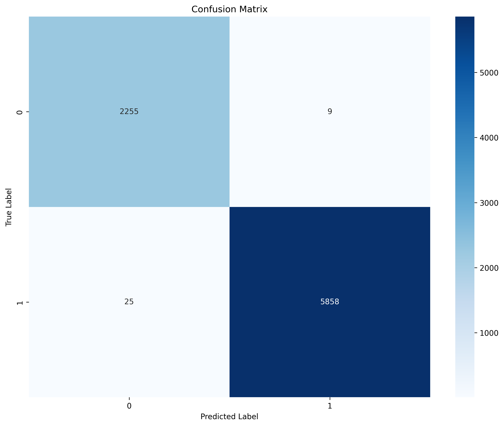
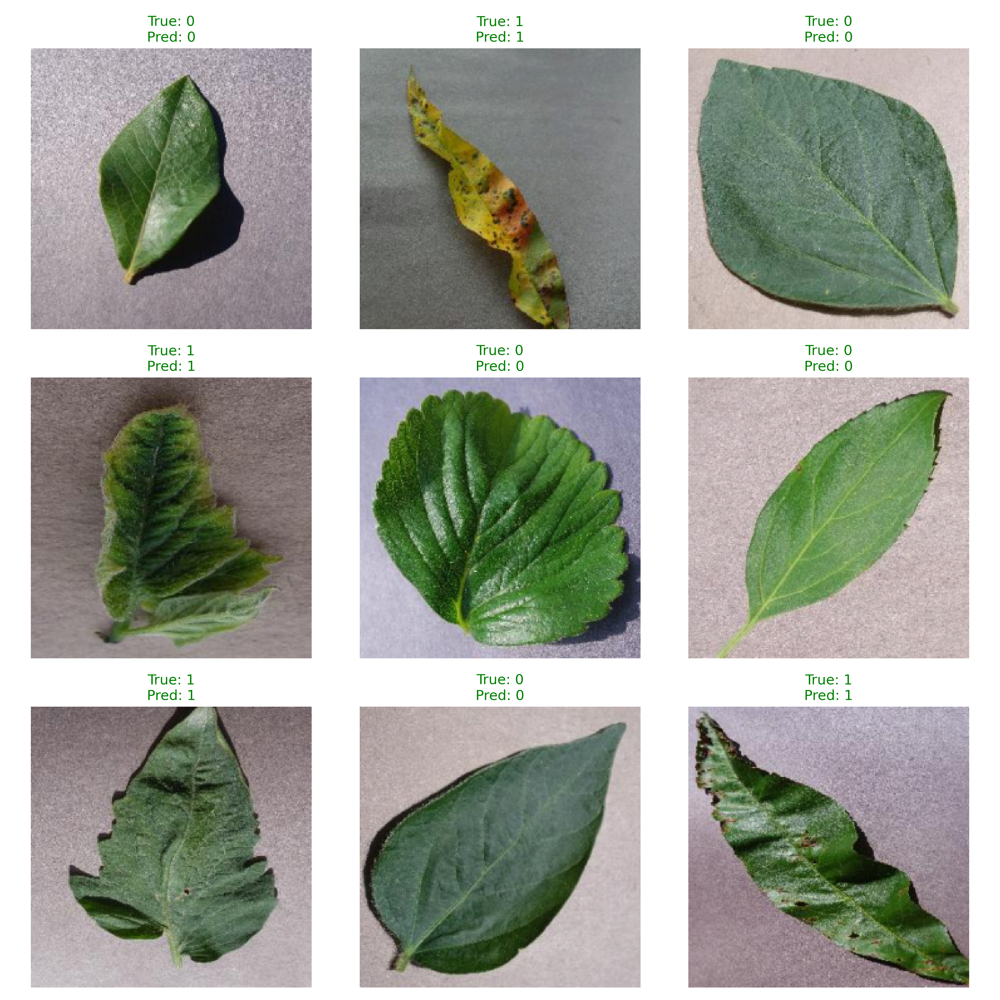

#  Классификация состояния растений по мультиспектральным снимкам

##  Описание проекта
Проект направлен на решение задачи бинарной классификации состояния растений по изображениям листьев: здоровое растение или больное. В качестве модели используется свёрточная нейронная сеть (EfficientNet, ResNet или Vision Transformer). Решение может быть применено для автоматизированного мониторинга посевов с помощью дронов и раннего выявления заболеваний.

##  Цель и мотивация
Сельское хозяйство сталкивается с проблемой быстрого распространения болезней растений, что приводит к значительным потерям урожая. Автоматическая диагностика по изображениям позволяет фермерам оперативно реагировать и принимать меры. Использование дронов с мультиспектральными камерами даёт возможность охватить большие площади, а нейросетевые модели обеспечивают высокую точность распознавания.

##  Использованные данные
В проекте применяется открытый датасет **[PlantVillage](https://github.com/spMohanty/PlantVillage-Dataset)**, содержащий **54 306 изображений** листьев растений (14 культур, 26 заболеваний). Для задачи бинарной классификации все изображения были разделены на два класса:
- **Здоровые** (метка 0) – 15 084 изображения
- **Больные** (метка 1) – 39 221 изображение

Данные были разбиты на обучающую, валидационную и тестовую выборки в пропорции 70/15/15.

##  Архитектура модели
В качестве базовой архитектуры выбрана **EfficientNet-B0** (предобученная на ImageNet) из библиотеки `timm`. Этот выбор обусловлен:
- высоким соотношением точности и вычислительной эффективности;
- хорошей производительностью на задачах классификации изображений;
- возможностью легкой замены на ResNet или Vision Transformer (ViT) при необходимости.

Модель была адаптирована под бинарную классификацию путём замены классификационной головы на полносвязный слой с двумя выходами.

## Метрики качества
Для оценки модели используются:
- **Accuracy** – общая точность
- **F1-score** (взвешенный) – гармоническое среднее точности и полноты
- **Precision** – точность
- **Recall** – полнота
- **Confusion matrix** – матрица ошибок

##  Результаты
После обучения модели в течение 30 эпох с оптимизатором Adam и планировщиком learning rate (ReduceLROnPlateau) были получены следующие результаты на тестовой выборке:

| Метрика       | Значение |
|---------------|----------|
| Accuracy      | 0.982    |
| F1-score (weighted) | 0.981 |
| Precision (weighted) | 0.981 |
| Recall (weighted)    | 0.982 |

### Матрица ошибок


### Кривые обучения


### Примеры предсказаний


##  Инструкция по запуску

### Требования
- Python 3.8+
- Виртуальное окружение (рекомендуется)
- CUDA-совместимый GPU (опционально, но ускоряет обучение)

### Установка
1. Клонируйте репозиторий:
   ```bash
   git clone https://github.com/your-repo/plants_disease_classes.git
   cd plants_disease_classes
